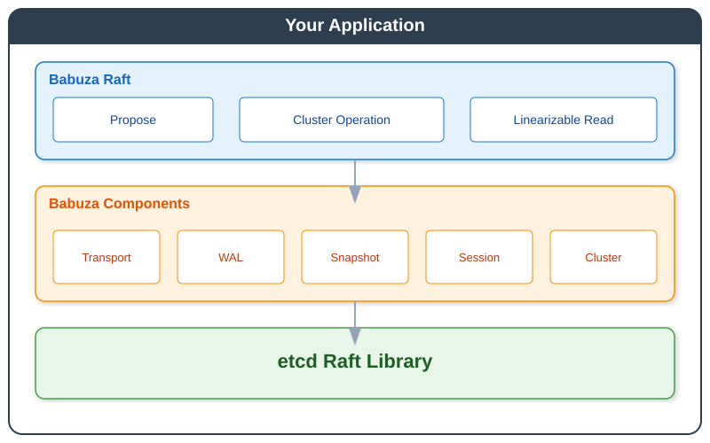

# Babuza

**Languages:** English | [繁體中文](./README.zh-TW.md)

Babuza turns [etcd Raft](https://github.com/etcd-io/raft) into an embeddable Go framework for production services. It provides the Raft runtime, WAL, snapshots, transport, sessions, cluster operations, and integration test harness you otherwise have to build around etcd/raft yourself.

### Is Babuza a fit?

Use Babuza when you are building a Go service that embeds Raft and want its surrounding infrastructure—storage, peer transport, snapshots, membership operations, and failure testing—to be supplied as one framework. You implement the state machine and application API; Babuza manages the Raft plumbing.

Babuza is not an etcd KV-compatible server or a cross-language consensus service. If you need either of those, use a dedicated service rather than embedding Babuza.

## Why Babuza?

Building distributed systems with Raft is hard. While etcd provides a battle-tested Raft implementation, using it directly requires significant effort:

- **Raft Ready Loop**: You must implement a goroutine to process `Ready()` structs, handle entries, messages, snapshots, and hard state persistence in the correct order
- **Storage Integration**: WAL and snapshot storage must be carefully coordinated - write entries before sending messages, apply snapshots atomically
- **Network Layer**: Build your own transport to send/receive Raft messages between peers, handle connection failures and retries
- **State Machine Lifecycle**: Manage snapshot creation, restoration, and log compaction while ensuring consistency
- **Cluster Membership**: Implement protocol for adding/removing nodes, handling joint consensus, and learner promotion

| Concern | etcd/raft alone | Babuza |
|-----------|-----------|--------|
| **Memory Storage** | `MemoryStorage` retains all entry payloads in memory | Index-based caching saves 94-99% memory |
| **Network Transport** | Application-provided | Pluggable TCP/HTTP/gRPC transports |
| **WAL** | Application-provided | Multiple backends: native, Badger, Pebble |
| **Snapshot Transfer** | Application-provided | Chunked, rate-limited transfer over HTTP |
| **Cluster Operations** | Manual peer management | Built-in add/remove/transfer APIs |
| **Idempotency** | Application handles dedup | Session-based exactly-once semantics |
| **Observability** | Roll your own | Prometheus & OpenTelemetry built-in |
| **Disaster Recovery** | Complex manual process | One-command standalone restoration |
| **Integration Testing** | Write your own test harness | testcluster with fault injection & partition simulation |

**Babuza lets you focus on your application logic, not Raft plumbing.**

## Core Features

| Feature | What Babuza Provides |
|---------|----------------------|
| **Raft Runtime** | Ready-loop processing, proposal handling, linearizable reads, and lifecycle management |
| **WAL Backends** | Native Babuza WAL, etcd WAL, Badger, and Pebble options |
| **Snapshot Management** | Durable, volatile, and S3-compatible snapshot storage with chunked HTTP transfer |
| **Transport Layer** | Pluggable TCP, HTTP, and gRPC transports, including HTTP stream mode |
| **Client Sessions** | Optional exactly-once semantics through no-op, expiring, or LRU session managers |
| **Cluster Operations** | Add/remove/update peers, promote learners, transfer leadership, and disaster recovery |
| **Testing Harness** | Multi-node testcluster support with partitions, node failures, restarts, and fault injection |
| **Observability** | Prometheus and OpenTelemetry integration points |

## Performance

### Memory Efficiency

| Entries | Data Size | etcd Memory | Babuza Memory | Saved |
|---------|-----------|-------------|---------------|-------|
| 100K | 1 KB | 102 MB | 5.35 MB | **94.8%** |
| 100K | 10 KB | 981 MB | 5.35 MB | **99.5%** |

Babuza stores log entry metadata in memory and reads entry payloads from WAL on demand, so memory usage stays mostly independent of entry data size. See the full [Memory Usage Benchmark Report](./docs/benchmarks/memory-usage-comparison.md).

### HTTP Stream Transport

HTTP transport supports an opt-in message stream mode for Raft batch messages. Peers open receiver-initiated `GET /raft/messages/stream` response streams, and senders write framed Raft batches into those active streams to reduce per-message HTTP request overhead.

Snapshots use a separate, chunked transfer: Babuza splits a snapshot into application-level chunks, rate-limits them, and sends each chunk synchronously with `POST /raft/snapshot`. This is not HTTP `Transfer-Encoding: chunked`; the message stream mode does not change snapshot transfer semantics.

Latest local benchmark on Apple M4:

| Workload | Short Request | Message Stream Enabled | Result |
|----------|---------------|------------------------|--------|
| Batch message | 26.918 us/op | 1.625 us/op | 16.6x faster |
| Snapshot, 32 x 256 B chunks | 940.638 us/op | 938.864 us/op | unchanged; short request |
| Snapshot, 4 x 8 KiB chunks | 177.084 us/op | 176.838 us/op | unchanged; short request |

See the [HTTP Stream Benchmark Comparison](./docs/benchmarks/http-stream-benchmark-comparison.md) for benchmark details and allocation results.

## Architecture



## Quick Start

Requires Go 1.24 or later. The quickest way to run a working single-node cluster is:

```bash
git clone https://github.com/fanaujie/babuza.git
cd babuza/examples/simple
go run .
```

The example starts a single-node cluster, proposes two key-value updates, reads them back, and shuts down. See the [simple example](./examples/simple/README.md) for a walkthrough.

To embed Babuza in your own Go module:

```bash
go get github.com/fanaujie/babuza
```

```go
package main

import (
	"context"
	"encoding/json"
	"fmt"
	"sync"
	"time"

	"github.com/fanaujie/babuza/ibabuza"
	"github.com/fanaujie/babuza/raft"
)

// 1. Implement your state machine
type KVStore struct {
	mu   sync.RWMutex
	data map[string]string
}

func (s *KVStore) Apply(e ibabuza.Entry) ibabuza.ApplyResult {
	var cmd struct{ Key, Value string }
	json.Unmarshal(e.Command, &cmd)
	s.mu.Lock()
	s.data[cmd.Key] = cmd.Value
	s.mu.Unlock()
	return ibabuza.ApplyResult{LogIndex: e.Index}
}
func (s *KVStore) Query(key any) (any, error) {
	s.mu.RLock()
	defer s.mu.RUnlock()
	return s.data[key.(string)], nil
}
func (s *KVStore) SaveSnapshot(ibabuza.StateMachineSnapshotContext, ibabuza.StateMachineSnapshotWriter) error { return nil }
func (s *KVStore) RestoreFromSnapshot(ibabuza.StateMachineSnapshotReader) error { return nil }
func (s *KVStore) Close() error { return nil }

func main() {
	// 2. Start Raft with default settings
	r, _ := raft.NewDefaultBuilder().
		DataDir("/tmp/babuza").
		StateMachine(&KVStore{data: make(map[string]string)}).
		Start()

	// 3. Wait for leader election
	time.Sleep(2 * time.Second)

	// 4. Propose data through Raft consensus
	data, _ := json.Marshal(map[string]string{"Key": "hello", "Value": "world"})
	r.Propose(context.Background(), raft.ClientSession{}, data).WaitForApplyResult()

	fmt.Println("Data committed through Raft consensus!")
	r.Shutdown().Wait()
}
```

## Examples

| Example | Description |
|---------|-------------|
| [Simple](./examples/simple/README.md) | Minimal single-node Raft example |
| [KV Store](./examples/kvstore/README.md) | Single-raft distributed key-value store with REST API |
| [Distributed Lock](./examples/distlock/README.md) | Lease-based distributed lock with fencing tokens and wait queue |
| [Redis Cluster](./examples/redis-cluster/README.md) | Multi-raft Redis-compatible distributed cache |

## Documentation

### Core Packages

| Package | Description |
|---------|-------------|
| [ibabuza](./ibabuza/README.md) | Core interfaces for all pluggable components |
| [raft](./raft/README.md) | Consensus layer, cluster bootstrap, and Raft API |
| [pkg/builder](./pkg/builder/README.md) | Component builder pattern for easy assembly |

### Infrastructure Packages

| Package | Description |
|---------|-------------|
| [pkg/cluster](./pkg/cluster/README.md) | Cluster membership and peer management |
| [pkg/transport](./pkg/transport/README.md) | Network transport layer (TCP, HTTP, gRPC) |
| [pkg/session](./pkg/session/README.md) | Client session management for idempotency |
| [pkg/snapshot](./pkg/snapshot/README.md) | Snapshot creation, storage, and restoration |
| [pkg/wal](./pkg/wal/README.md) | Write-ahead log implementations |

## Configuration

### Component Types

| Component | Available Types |
|-----------|-----------------|
| **Session** | `noop`, `expire`, `lru` |
| **Transport** | `tcp`, `tcp-memory`, `http`, `grpc` |
| **WAL** | `babuza-wal`, `etcd-wal`, `badger-wal`, `badger-wal-memory`, `pebble-wal`, `pebble-wal-memory` |
| **Snapshot** | `durable`, `volatile`, `s3` |
| **Metrics** | `otel`, `prometheus` |

## Experimental Multi-Raft

The [raft/experimental](./raft/experimental/README.md) package implements multi-Raft group support without modifying the upstream etcd Raft library:

- **Coalesced Heartbeats** - Merge heartbeats from multiple Raft groups to reduce network overhead
- **Shared WAL** - Multiple Raft groups share a single WAL instance
- **Sharded Scheduling** - Efficient processing across many Raft groups

## Test Cluster Framework

Babuza provides a [testcluster](./test/testcluster/README.md) framework for testing distributed system failure scenarios:

**Supported Failure Scenarios:**

| Scenario | Description |
|----------|-------------|
| **Node Disconnect** | Simulate single node network failure |
| **Network Partition** | Split cluster into isolated groups |
| **Leader Failure** | Stop/restart leader node |
| **Quorum Loss** | Disconnect majority of nodes |
| **Node Restart** | Stop and restart with WAL/snapshot recovery |
| **Disaster Recovery** | Recover standalone from lost cluster |

## Contributing

Contributions are welcome! Please ensure:

1. Tests are included for new functionality
2. Documentation is updated as needed

## License

Apache License 2.0. See [LICENSE](./LICENSE) for details.

Copyright 2025 Chen Chunchieh
