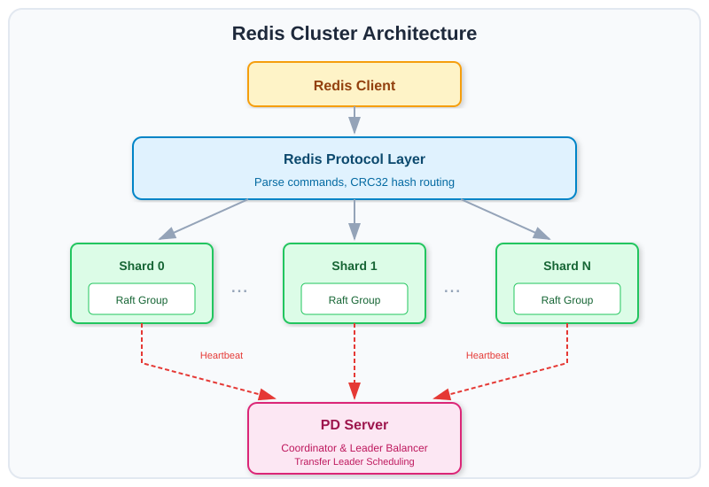

# Redis Cluster

A Redis-compatible distributed cache built with the Babuza Raft framework, demonstrating sharded multi-Raft group deployment.

## Overview

This example implements a Redis-compatible distributed cache using Babuza's multi-Raft capabilities. Data is sharded across multiple Raft groups, each managing a subset of keys for horizontal scalability.

## Features

- Redis protocol compatibility (use standard Redis clients)
- Sharded data distribution across multiple Raft groups
- Consistent hashing for key-to-shard mapping
- Multi-store deployment for high availability
- Placement Driver (PD) for cluster management
- Automatic leader load balancing across stores

## Quick Start

### Build

```bash
cd examples/redis-cluster
go build -o redis-cluster .
```

### Start PD Server

The Placement Driver (PD) server must be started first for cluster coordination:

```bash
./redis-cluster pd \
  --http-address=127.0.0.1:15000 \
  --grpc-address=127.0.0.1:15001
```

### Start a 3-Node Cluster

Using the provided helper script:

```bash
# Start 3 nodes with 32 shards each
./start-redis.sh 1 32 ./data1 &
./start-redis.sh 2 32 ./data2 &
./start-redis.sh 3 32 ./data3 &
```

Or manually:

```bash
# Node 1
./redis-cluster server \
  --shards=32 \
  --store-id=1 \
  --data-dir=./data1 \
  --redis-address=127.0.0.1:10001 \
  --raft-address=127.0.0.1:14200 \
  --pd-address=127.0.0.1:15001 \
  --initial-raft-stores=1=127.0.0.1:14200,2=127.0.0.1:14201,3=127.0.0.1:14202

# Node 2
./redis-cluster server \
  --shards=32 \
  --store-id=2 \
  --data-dir=./data2 \
  --redis-address=127.0.0.1:10002 \
  --raft-address=127.0.0.1:14201 \
  --pd-address=127.0.0.1:15001 \
  --initial-raft-stores=1=127.0.0.1:14200,2=127.0.0.1:14201,3=127.0.0.1:14202

# Node 3
./redis-cluster server \
  --shards=32 \
  --store-id=3 \
  --data-dir=./data3 \
  --redis-address=127.0.0.1:10003 \
  --raft-address=127.0.0.1:14202 \
  --pd-address=127.0.0.1:15001 \
  --initial-raft-stores=1=127.0.0.1:14200,2=127.0.0.1:14201,3=127.0.0.1:14202
```

### Connect with Redis CLI

```bash
redis-cli -p 10001

127.0.0.1:10001> PING
PONG
127.0.0.1:10001> SET mykey myvalue
OK
127.0.0.1:10001> GET mykey
"myvalue"
127.0.0.1:10001> ECHO hello
"hello"
```

### Using Procfile (with foreman/overmind)

```bash
# Start all nodes at once
foreman start
# or
overmind start
```

## Supported Commands

Currently, the following Redis commands are supported:

| Command | Description |
|---------|-------------|
| `PING` | Health check, returns PONG |
| `ECHO <message>` | Returns the given message |
| `SET <key> <value>` | Set a key-value pair |
| `GET <key>` | Get the value of a key |

## Configuration

### Server Flags

| Flag | Default | Description |
|------|---------|-------------|
| `--shards` | `100` | Number of shards (Raft groups) |
| `--store-id` | `1` | Unique store/node ID |
| `--cluster-id` | `10000` | Cluster ID |
| `--data-dir` | `./data` | Data storage directory |
| `--redis-address` | `localhost:6379` | Redis protocol listen address |
| `--raft-address` | `localhost:14200` | Raft communication address |
| `--pd-address` | `localhost:15001` | PD gRPC address for cluster management |
| `--initial-raft-stores` | - | Initial cluster members (ID=address format) |
| `--interval-heartbeat-store` | `1` | Store heartbeat interval (seconds) |
| `--interval-heartbeat-raft-group-leader` | `3` | Raft group leader heartbeat interval (seconds) |

### PD Server Flags

| Flag | Default | Description |
|------|---------|-------------|
| `--http-address` | `localhost:15000` | HTTP server listen address |
| `--grpc-address` | `localhost:15001` | gRPC server listen address |

## Architecture



Each shard is a separate Raft group. Keys are mapped to shards using CRC32 consistent hashing.

## Leader Load Balancing

The PD server implements automatic leader load balancing across stores:

1. Each store periodically sends heartbeats to PD with its leader count
2. PD calculates the average leader count across all stores
3. When a store has significantly more leaders than average (threshold: +2), PD schedules a leader transfer
4. Leaders are transferred from overloaded stores to underloaded stores
5. This ensures even distribution of write load across the cluster

The scheduling algorithm:
- Calculates distance from average for each store
- Prioritizes transferring from stores furthest above average
- Uses exponential backoff when no transfers are needed
