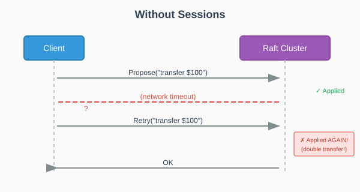
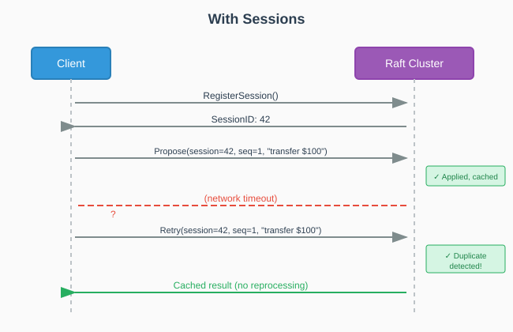
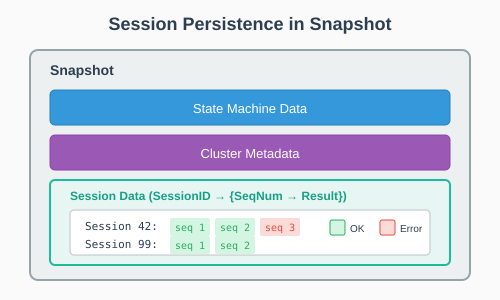

# pkg/session

Client session management for idempotent request handling in Babuza clusters.

## Overview

The `session` package provides session tracking to ensure exactly-once semantics for client requests. When a client retries a request, the session manager can detect duplicates and return the cached result instead of reprocessing.

## Proposal Idempotency

Babuza's session management ensures **exactly-once semantics** for proposals, solving the common distributed systems challenge of duplicate requests:

### The Problem



### The Solution



### How It Works

1. **Session Registration**: Client registers a session before proposing
2. **Sequence Numbers**: Each proposal includes session ID + monotonic sequence number
3. **Result Caching**: After applying, result is cached with the sequence number
4. **Duplicate Detection**: Retried proposals with same session+sequence return cached result
5. **Session Cleanup**: Sessions are evicted via time expiration or LRU policy

### Workflow Example

```go
// Client side
ctx := context.Background()

// 1. Register session
result := raft.RegisterSession(ctx)
session, _ := result.Result()
sessionID := session.Response.(uint64)

// 2. Propose with session tracking
clientSession := raft.ClientSession{
    SessionID:      sessionID,
    SequenceNumber: 1,  // Increment for each new request
}

// 3. Even if this times out and client retries...
result = raft.Propose(ctx, clientSession, []byte("transfer $100"))

// 4. Retry with SAME session ID and sequence number
// Babuza returns cached result, no double-apply
result = raft.Propose(ctx, clientSession, []byte("transfer $100"))
```

### Session Persistence

Sessions are included in snapshots and replicated across the cluster:



## Key Types

| Type | Description |
|------|-------------|
| `Session` | Individual client session with request/response tracking |
| `NoOpManager` | No-op session manager (no idempotency) |
| `ExpiredManager` | Time-based session expiration |
| `LruManager` | LRU-based session eviction |

## Session Strategies

| Strategy | Use Case |
|----------|----------|
| `NoOpSession` | Testing or when idempotency is not needed |
| `ExpireSession` | Sessions expire after a fixed TTL |
| `LRUSession` | Bounded memory with LRU eviction |

## Bypassing Session Tracking

Use `SessionID = 0` (`NoOPSessionID`) to bypass session tracking for requests that don't need idempotency:

```go
// Skip session tracking - use for read-only or idempotent-by-nature operations
clientSession := raft.ClientSession{
    SessionID:      0,  // NoOPSessionID - no session tracking
    SequenceNumber: 0,
}
result := raft.Propose(ctx, clientSession, readOnlyData)
```

When `SessionID` is 0, the session manager returns a no-op session that:
- Never detects duplicates
- Never caches results
- Has minimal overhead

## Usage

### Create via Builder

```go
import "github.com/fanaujie/babuza/pkg/builder"

// LRU session manager
component := builder.NewBabuzaComponentBuilder(&builder.BabuzaComponentConfig{
    SessionType: builder.LRUSession,
}).Build()

sessionMgr := component.SessionManager
```

### Direct Creation

```go
import "github.com/fanaujie/babuza/pkg/session"

// No-op manager
noopMgr := session.NewNoOpManager(logger)

// Expire manager with options
expireMgr := session.NewExpiredManager(logger,
    session.SetExpiredMgrOptionsWithExpiredTime(time.Hour),
)

// LRU manager with options
lruMgr := session.NewLruManager(logger,
    session.SetLruMgrOptionsWithMaxSessions(10000),
)
```

### Register and Use Sessions

```go
// Register a new session
timestamp := time.Now().UnixNano()
err := sessionMgr.Register(sessionID, timestamp)

// Get session
sess, err := sessionMgr.GetSession(sessionID)

// Check for duplicate request
if sess.RepeatSequenceNum(sequenceNum) {
    // Return cached result
    result, _ := sess.GetResult(sequenceNum)
    return result
}

// Process request and store result
result := processRequest(request)
err = sess.AddResult(sequenceNum, timestamp, result)

// Unregister session when done
err = sessionMgr.UnRegister(sessionID)
```

### Session Interface

```go
type Session interface {
    Id() uint64
    LastActiveNanoseconds() int64
    ClearResult(sequenceNum uint64)
    RepeatSequenceNum(sequenceNum uint64) bool
    AddResult(sequenceNum uint64, timestamp int64, result ApplyResult) error
    GetResult(sequenceNum uint64) (ApplyResult, bool)
    Snapshot(io.Writer, ApplyResultSerializer) error
    Restore(io.Reader, ApplyResultSerializer) error
}
```

### SessionManager Interface

```go
type SessionManager interface {
    SetResponseSerializer(ResponseSerializer) error
    GetSession(sessionID uint64) (Session, error)
    Register(sessionID uint64, timestamp int64) error
    UnRegister(sessionID uint64) error
    ExpireSession(timestamp int64)
    Snapshot(io.Writer) error
    Restore(io.Reader) error
}
```

### Snapshot and Restore

```go
// Snapshot all sessions
var buf bytes.Buffer
err := sessionMgr.Snapshot(&buf)

// Restore sessions
err = sessionMgr.Restore(&buf)
```

## Configuration Options

### ExpiredManager Options

| Option | Description | Default |
|--------|-------------|---------|
| `SetExpiredMgrOptionsWithExpiredTime(duration)` | Session expiration time | 30 minutes |
| `SetExpiredMgrOptionsWithSnapshotCompressionType(type)` | Snapshot compression type | None |

### LruManager Options

| Option | Description | Default |
|--------|-------------|---------|
| `SetLruMgrOptionsWithMaxSessions(count)` | Maximum number of sessions | 128 |
| `SetLruMgrOptionsWithSnapshotCompressionType(type)` | Snapshot compression type | None |
