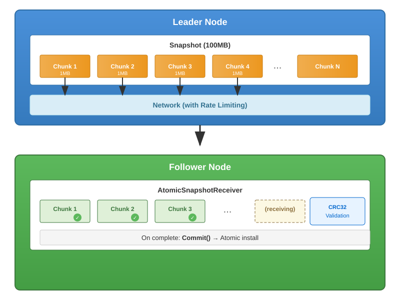
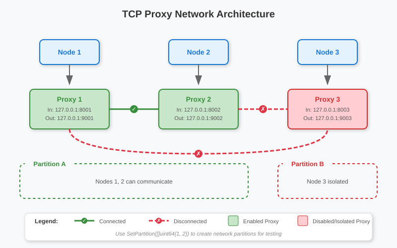

# pkg/transport

Network transport layer for Raft message and snapshot communication between cluster peers.

## Overview

The `transport` package provides the abstraction and implementations for peer-to-peer communication in a Babuza cluster. It supports multiple protocols (TCP, HTTP, gRPC) and handles both regular Raft messages and snapshot transfers.

## Chunked Snapshot Transfer

Babuza's transport layer implements **chunked snapshot transfer** to efficiently handle large snapshots:

### How It Works



### Key Benefits

| Feature | Benefit |
|---------|---------|
| **Chunked Transfer** | Large snapshots don't block memory allocation |
| **Rate Limiting** | Prevents network saturation, fair bandwidth sharing |
| **Resumable** | On network interruption, can resume from last chunk |
| **Atomic Installation** | Snapshot only installed after all chunks received |
| **Memory Efficient** | Chunks written to disk immediately, low memory footprint |

### Configuration

```go
import (
    "github.com/fanaujie/babuza/pkg/builder"
    "github.com/fanaujie/babuza/pkg/utility/limiter"
    "golang.org/x/time/rate"
)

// Configure snapshot chunk settings via builder
builder.NewBabuzaComponentBuilder(&builder.BabuzaComponentConfig{
    // ...
}).SetTransportAssets(builder.TransportAssets{
    // Rate limit: 10 events/sec with burst of 1
    SnapshotChuckRateLimiter: limiter.NewStandardRateLimiter(
        rate.Limit(10), // 10 chunks per second
        1,              // burst size
    ),
}).Build()
```

### Snapshot Transfer Protocol

The snapshot transfer uses a three-phase protocol:

| Phase | Message Type | Description |
|-------|--------------|-------------|
| 1. Metadata | `SnapshotMessageType_Metadata` | Sends snapshot metadata (index, term, file descriptors) |
| 2. Chunks | `SnapshotMessageType_Chunk` | Streams file chunks with CRC32 validation |
| 3. Finish | `SnapshotMessageType_Finish` | Commits the snapshot with final Raft message |

### Chunk Message Structure

```go
// Defined in ibabuza/babuzapb/raftMsg.proto
type SnapshotChunkMessage struct {
    FileType      SnapshotFileType  // Type of file being transferred
    FileTag       string            // File identifier tag
    Id            int64             // Chunk sequence number
    Data          []byte            // Chunk data
    ContinueCrc32 uint32            // Running CRC32 checksum (Castagnoli)
    LastChunk     bool              // Final chunk indicator
}
```

### CRC32 Validation

Each chunk includes a running CRC32 checksum (Castagnoli polynomial) that accumulates across all chunks of a file. This enables detection of data corruption during transfer without waiting for the complete file.

## Key Types

| Type | Description |
|------|-------------|
| `Transport` | Main transport implementation |
| `PeerManager` | Manages peer connections and addresses |
| `PeerFactory` | Creates peer instances |
| `TransportAssets` | Resource limiters and circuit breakers |

## Transport Assets

Transport assets provide flow control and fault tolerance:

### Resource Limiter

Controls memory usage for outgoing messages:

```go
import "github.com/fanaujie/babuza/pkg/utility/limiter"

// Limit total pending message size to 64MB
memLimiter := limiter.NewMemorySizeLimiter(64 * 1024 * 1024)
```

### Rate Limiter

Controls snapshot chunk transfer rate:

```go
// Allow 10 chunks per second with burst of 1
rateLimiter := limiter.NewStandardRateLimiter(rate.Limit(10), 1)
```

### Circuit Breaker

Provides fault tolerance for peer connections:

```go
import "github.com/fanaujie/babuza/pkg/utility/breaker"

// Use no-op breaker (always ready)
circuitBreaker := breaker.NewNoOpBreaker()
```

When a peer fails to send messages, the circuit breaker marks the connection as unhealthy and reports the peer as unreachable to Raft.

## Supported Protocols

| Protocol | Package | Description |
|----------|---------|-------------|
| TCP | `protocol/tcp` | Raw TCP with length-prefixed messages |
| HTTP | `protocol/http` | HTTP/1.1 transport |
| gRPC | `protocol/grpc` | gRPC with streaming support |

## Usage

### Create Transport via Builder

```go
import "github.com/fanaujie/babuza/pkg/builder"

component := builder.NewBabuzaComponentBuilder(&builder.BabuzaComponentConfig{
    TransportType: builder.TcpTransport,
}).Build()

transport := component.Transport
```

### Direct Transport Creation

```go
import (
    "github.com/fanaujie/babuza/pkg/transport"
    "github.com/fanaujie/babuza/pkg/transport/protocol"
    "github.com/fanaujie/babuza/pkg/transport/protocol/tcp/networkio"
)

peerManager := transport.NewPeerManager[peer.Peer]()
proto := protocol.NewTcp(networkio.NewTcpPhysicalIO(), logger)

trans := transport.New(
    clusterID,
    peerManager,
    limiter.NewNoResourceLimiter(),
    limiter.NewNoOpRateLimiter(),
    breaker.NewNoOpBreaker(),
    proto,
    logger,
)
```

### Configure Transport

```go
err := trans.SetupTransportConfig(ibabuza.TransportConfig{
    LocalNodeID: 1,
    PeerAddress: "127.0.0.1:7001",
    TLSConfig: ibabuza.TLSConfig{
        EnableTLS: true,
        MutualTLS: true,
        TLSCert:   "/path/to/cert.pem",
        TLSKey:    "/path/to/key.pem",
        TLSRootCA: "/path/to/ca.pem",
    },
})
```

### Manage Peers

```go
// Add peer
trans.AddPeer(2, "127.0.0.1:7002")

// Update peer address
trans.UpdatePeer(2, "127.0.0.1:7003")

// Remove peer
trans.RemovePeer(2)

// Remove all peers
trans.RemovePeers()
```

### Send Messages

```go
// Start transport
err := trans.Start()

// Send Raft message
trans.Send(raftpb.Message{
    Type: raftpb.MsgApp,
    To:   2,
    From: 1,
    // ...
})

// Send snapshot
trans.SendSnapshot(raftpb.Message{
    Type:     raftpb.MsgSnap,
    To:       2,
    Snapshot: snapshot,
})
```

### Create Client for Direct Communication

```go
client, err := trans.CreateTransportClient()
defer client.Close()

// Send batch message
err = client.SendBatchMessage(batchMsg)

// Get cluster peers
resp, err := client.GetClusterPeers(req)
```

## TLS Configuration

```go
tlsConfig := ibabuza.TLSConfig{
    EnableTLS: true,           // Enable TLS
    MutualTLS: true,           // Require client certificates
    TLSCert:   "cert.pem",     // Server certificate
    TLSKey:    "key.pem",      // Private key
    TLSRootCA: "ca.pem",       // CA certificate for verification
}
```

## Protocol Options

### TCP Options

```go
import "github.com/fanaujie/babuza/pkg/transport/protocol"

builder.AddTcpOptions(
    protocol.SetTcpOptsWithDialTimeout(time.Second * 5),
    protocol.SetTcpOptsWithReadDeadline(time.Second * 10),
    protocol.SetTcpOptsWithWriteDeadline(time.Second * 10),
    protocol.SetTcpOptsWithMaxConnectionsPerHost(10),
    protocol.SetTcpOptsWithIdleTimeout(time.Minute * 5),
)
```

### gRPC Options

```go
import "github.com/fanaujie/babuza/pkg/transport/protocol"

builder.AddGrpcOptions(
    protocol.SetGrpcOptsWithRecvMsgMaxSize(64 * 1024 * 1024),
    protocol.SetGrpcOptsWithDialTimeout(time.Second * 5),
    protocol.SetGrpcOptsWithGrpcDeadline(time.Second * 10),
    protocol.SetGrpcOptsWithMaxConnectionsPerHost(10),
    protocol.SetGrpcOptsWithIdleTimeout(time.Minute * 5),
)
```

### HTTP Options

```go
import "github.com/fanaujie/babuza/pkg/transport/protocol"

builder.AddHttpOptions(
    protocol.SetHttpOptsWithReadDeadline(time.Second * 10),
    protocol.SetHttpOptsWithWriteDeadline(time.Second * 10),
    protocol.SetHttpOptsWithShutdownTimeout(time.Second * 5),
)
```

## Transport Interface

The `Transport` interface defines the main API for peer-to-peer communication:

```go
type Transport interface {
    // Lifecycle
    SetupTransportConfig(cfg TransportConfig) error  // Configure transport settings
    SetupTransportRaft(RaftNodeHandler) error        // Connect to Raft node
    Start() error                                     // Start listening
    Stop() error                                      // Stop transport

    // Message sending
    Send(raftpb.Message)                             // Send Raft message
    SendSnapshot(raftpb.Message)                     // Send snapshot (chunked)

    // Client creation
    CreateTransportClient() (TransportClient, error) // Create direct client

    // Peer management
    AddPeer(peerID uint64, address string)           // Add peer
    UpdatePeer(peerID uint64, address string)        // Update peer address
    RemovePeer(peerID uint64)                        // Remove peer
    RemovePeers()                                    // Remove all peers
}
```

### Transport Lifecycle

```
┌─────────────────────────────────────────────────────────────┐
│                    Transport Lifecycle                       │
├─────────────────────────────────────────────────────────────┤
│  1. NewBabuzaComponentBuilder()  → Create transport          │
│  2. SetupTransportConfig()       → Configure TLS, address    │
│  3. SetupTransportRaft()         → Connect Raft handler      │
│  4. Start()                      → Begin accepting messages  │
│  5. AddPeer() / UpdatePeer()     → Manage cluster peers      │
│  6. Send() / SendSnapshot()      → Send messages             │
│  7. Stop()                       → Shutdown gracefully       │
└─────────────────────────────────────────────────────────────┘
```

## TransportClient Interface

The `TransportClient` interface provides direct peer-to-peer communication:

```go
type TransportClient interface {
    // Send batch of Raft messages
    SendBatchMessage(BatchMessage) error

    // Send snapshot message (metadata, chunk, or finish)
    SendSnapshotMessage(SnapshotMessage) (SnapshotMessageResponse, error)

    // Query cluster peer information
    GetClusterPeers(GetClusterPeersRequest) (GetClusterPeersResponse, error)

    // Publish application service addresses
    PublishApplicationService(PublishApplicationServiceRequest) (PublishApplicationServiceResponse, error)

    // Close client connection
    Close() error
}
```

### Client API Methods

| Method | Description | Request | Response |
|--------|-------------|---------|----------|
| `SendBatchMessage` | Send multiple Raft messages in batch | `BatchMessage` | - |
| `SendSnapshotMessage` | Send snapshot transfer message | `SnapshotMessage` | `SnapshotMessageResponse` |
| `GetClusterPeers` | Query peer information | `GetClusterPeersRequest` | `GetClusterPeersResponse` |
| `PublishApplicationService` | Broadcast app service URLs | `PublishApplicationServiceRequest` | `PublishApplicationServiceResponse` |

### Client Usage Example

```go
// Create client from transport
client, err := transport.CreateTransportClient()
if err != nil {
    return err
}
defer client.Close()

// Send batch message
err = client.SendBatchMessage(babuzapb.BatchMessage{
    ClusterID: clusterID,
    Messages:  []raftpb.Message{msg1, msg2},
})

// Query cluster peers
resp, err := client.GetClusterPeers(babuzapb.GetClusterPeersRequest{
    ClusterID: clusterID,
    From:      localNodeID,
    To:        targetNodeID,
})
for _, peer := range resp.Peers {
    fmt.Printf("Peer %d: %s\n", peer.ID, peer.Address)
}
```

## TransportServer Interface

The `TransportServer` interface handles incoming connections:

```go
type TransportServer interface {
    Start() error  // Start listening for connections
    Stop() error   // Stop server gracefully
}
```

### Server Message Handler

The server delegates message processing to `RaftMessageHandler`:

```go
type RaftMessageHandler interface {
    // Process batch of Raft messages
    ProcessBatchMessage(BatchMessage)

    // Process snapshot message and return response
    ProcessSnapshotMessage(SnapshotMessage) SnapshotMessageResponse

    // Return cluster peer information
    GetClusterPeer(GetClusterPeersRequest) GetClusterPeersResponse

    // Handle application service publication
    PublishApplicationService(PublishApplicationServiceRequest) PublishApplicationServiceResponse
}
```

## Protocol Implementation Details

### TCP Protocol

TCP uses a custom frame protocol with CRC32 checksums:

**Frame Format:**
```
┌──────────────────────────────────────────────────────┐
│  CRC32 (4 bytes)  │  Type+Size (4 bytes)  │  Payload │
└──────────────────────────────────────────────────────┘
     Castagnoli         Type: 1 byte
                        Size: 3 bytes (max 16MB)
```

**Message Types:**

| Type | Value | Description |
|------|-------|-------------|
| `BatchMsgType` | 1 | Batch Raft messages |
| `SnapshotMsgReqType` | 2 | Snapshot request |
| `SnapshotMsgResType` | 3 | Snapshot response |
| `ClusterPeersReqType` | 4 | Get peers request |
| `ClusterPeersResType` | 5 | Get peers response |
| `PubAppServiceReqType` | 6 | Publish app service request |
| `PubAppServiceResType` | 7 | Publish app service response |

**TCP Connection Flow:**
```
Client                                Server
  │                                      │
  │─────── Connect (TLS handshake) ─────►│
  │                                      │
  │─────── Frame: BatchMessage ─────────►│
  │                                      │ ProcessBatchMessage()
  │                                      │
  │─────── Frame: SnapshotMsgReq ───────►│
  │◄────── Frame: SnapshotMsgRes ────────│ ProcessSnapshotMessage()
  │                                      │
  │─────── Frame: ClusterPeersReq ──────►│
  │◄────── Frame: ClusterPeersRes ───────│ GetClusterPeer()
  │                                      │
```

### HTTP Protocol

HTTP uses REST-like endpoints with protobuf serialization:

| Endpoint | Method | Request Body | Response Body |
|----------|--------|--------------|---------------|
| `/raft/messages` | POST | `BatchMessage` | - |
| `/raft/snapshot` | POST | `SnapshotMessage` | `SnapshotMessageResponse` |
| `/raft/peers` | GET | Query params | `GetClusterPeersResponse` |
| `/raft/app-service-urls` | POST | `PublishApplicationServiceRequest` | `PublishApplicationServiceResponse` |

**Query Parameters for `/raft/peers`:**
- `clusterID` - Cluster identifier
- `from` - Source node ID
- `to` - Target node ID

### gRPC Protocol

gRPC uses protobuf service definition:

```protobuf
service RaftTransport {
    rpc SendBatchMessage(BatchMessage) returns (google.protobuf.Empty);
    rpc SendSnapshotMessage(SnapshotMessage) returns (SnapshotMessageResponse);
    rpc GetClusterPeers(GetClusterPeersRequest) returns (GetClusterPeersResponse);
    rpc PublishApplicationService(PublishApplicationServiceRequest)
        returns (PublishApplicationServiceResponse);
}
```

## Connection Pooling

All protocols use connection pooling for efficiency:

```go
// Pool configuration (internal)
poolConfig := connpool.Config{
    MaxConnectionsPerHost: 5,           // Max connections per peer
    IdleTimeout:           5 * time.Minute,  // Close idle connections
}
```

**Pool Behavior:**
- Connections are reused across requests
- Failed connections are removed from pool
- Idle connections are closed after timeout
- New connections created on demand

## TCP Proxy Network

The `proxynetwork` package provides a **simulated network layer** for testing Raft cluster behavior under network partition scenarios. It wraps actual TCP connections with controllable proxy nodes that can be selectively connected or disconnected.

### Purpose

| Use Case | Description |
|----------|-------------|
| **Network Partition Testing** | Simulate network splits where subsets of nodes cannot communicate |
| **Fault Injection** | Test cluster resilience by disconnecting specific nodes |
| **Chaos Engineering** | Validate Raft consensus behavior during network failures |
| **Integration Testing** | Create reproducible network failure scenarios |

### Architecture



### Proxy Configuration

```go
import "github.com/fanaujie/babuza/ibabuza"

// ProxyConfig defines a proxy node
type ProxyConfig struct {
    Id                uint64      // Unique proxy identifier
    InAddr            string      // Incoming connection address (listen)
    OutAddr           string      // Outgoing connection address (forward to)
    InListenTLSConfig TLSConfig   // TLS config for incoming connections
    OutDialTLSConfig  TLSConfig   // TLS config for outgoing connections
}
```

### Basic Usage

```go
import "github.com/fanaujie/babuza/pkg/transport/protocol/tcp/networkio/proxynetwork"

// Create proxy network
network := proxynetwork.New()
defer network.TeardownNetwork()

// Add proxies for each node
network.AddProxy(ibabuza.ProxyConfig{
    Id:      1,
    InAddr:  "127.0.0.1:8001",
    OutAddr: "127.0.0.1:9001",
})
network.AddProxy(ibabuza.ProxyConfig{
    Id:      2,
    InAddr:  "127.0.0.1:8002",
    OutAddr: "127.0.0.1:9002",
})
network.AddProxy(ibabuza.ProxyConfig{
    Id:      3,
    InAddr:  "127.0.0.1:8003",
    OutAddr: "127.0.0.1:9003",
})

// Enable all proxies
network.ConnectProxy(1)
network.ConnectProxy(2)
network.ConnectProxy(3)

// Allow all nodes to communicate
network.SetPartition([]uint64{1, 2, 3})
```

### Simulating Network Partitions

```go
// Partition: nodes 1,2 can communicate; node 3 is isolated
network.SetPartition([]uint64{1, 2})  // Partition A
network.SetPartition([]uint64{3})      // Partition B (isolated)

// After partition:
// - Node 1 ↔ Node 2: ✓ Connected
// - Node 1 ↔ Node 3: ✗ Blocked
// - Node 2 ↔ Node 3: ✗ Blocked

// Heal the partition (restore full connectivity)
network.SetPartition([]uint64{1, 2, 3})
```

### Proxy Network API

| Method | Description |
|--------|-------------|
| `New()` | Create a new proxy network instance |
| `AddProxy(config)` | Add a proxy node to the network |
| `DeleteProxy(proxyId)` | Remove a proxy from the network |
| `ConnectProxy(proxyId)` | Enable a proxy (start listening) |
| `DisconnectProxy(proxyId)` | Disable a proxy (stop listening, close connections) |
| `IsProxyConnected(proxyId)` | Check if a proxy is enabled |
| `SetPartition(proxyIds)` | Define which proxies can communicate |
| `Dial(cfg, fromId, toEndpoint)` | Create a connection through the proxy network |
| `DialWithTimeout(cfg, fromId, toEndpoint, timeout)` | Dial with connection timeout |
| `Listen(cfg, endpoint)` | Create a listener for incoming connections |
| `TeardownNetwork()` | Disable all proxies and clean up resources |
| `ConnectProxiesIds()` | Get list of enabled proxy IDs |
| `DisconnectProxiesIds()` | Get list of disabled proxy IDs |
| `SaveTopologyAsSVG(filename)` | Export network topology as SVG diagram |

### Testing Scenarios

**Scenario 1: Leader Isolation**
```go
// Isolate the leader (node 1) from followers
network.SetPartition([]uint64{1})      // Leader isolated
network.SetPartition([]uint64{2, 3})   // Followers can communicate

// Expected: Followers elect new leader, old leader steps down
```

**Scenario 2: Minority Partition**
```go
// Create minority partition (2 nodes) vs majority (3 nodes)
network.SetPartition([]uint64{1, 2})       // Minority
network.SetPartition([]uint64{3, 4, 5})    // Majority

// Expected: Majority partition maintains consensus
```

**Scenario 3: Node Failure and Recovery**
```go
// Disconnect a node
network.DisconnectProxy(2)

// Node 2 is now unreachable
// ... run tests ...

// Reconnect the node
network.ConnectProxy(2)
network.SetPartition([]uint64{1, 2, 3})

// Expected: Node 2 catches up via snapshot or log replication
```

### Topology Visualization

The proxy network can export its topology as an SVG diagram for debugging:

```go
// Export current topology
err := network.SaveTopologyAsSVG("network_topology.svg")
```

This generates a visual representation showing:
- All proxy nodes with their addresses
- Enabled (green) vs disabled (red) status
- Partition groupings