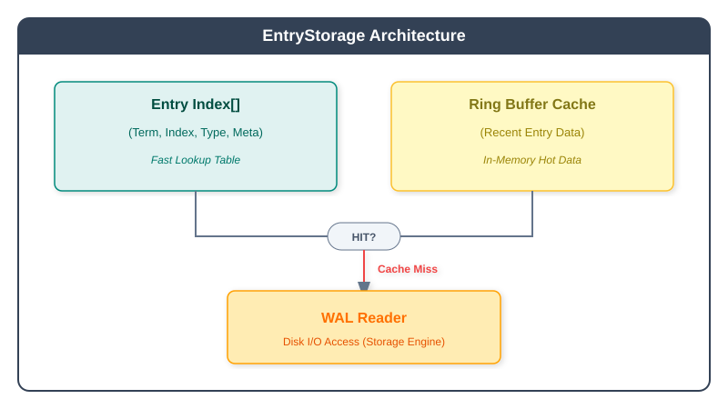

# pkg/wal

Write-ahead log implementations for durable storage of Raft entries.

## Overview

The `wal` package provides multiple WAL (Write-Ahead Log) implementations for persisting Raft log entries before they are applied. The WAL ensures durability and enables recovery after crashes.

## Memory-Efficient Index-Based Architecture

Unlike etcd which keeps **all log entries in memory**, Babuza's WAL uses an innovative **index + cache** architecture that significantly reduces memory usage:

### How It Works



### Key Benefits

| Aspect | etcd Approach | Babuza Approach |
|--------|---------------|-----------------|
| **Memory Usage** | All entries in memory | Only index metadata + recent cache |
| **Scalability** | Memory grows with log | Bounded memory regardless of log size |
| **Read Path** | Always from memory | Cache hit: memory, Miss: disk |
| **Write Path** | Memory + disk | Memory + disk (same) |

### Components

- **Entry Index Array (`EntryIndex[]`)**: Stores only metadata per entry
  - `Term`: Raft term when entry was created
  - `Index`: Log index
  - `Type`: Entry type (normal, config change)
  - `Metadata`: WAL file offset for reading data

- **Ring Buffer Cache**: Fixed-size cache for recent entry data
  - Configurable buffer size (default: 128 entries)
  - Auto-grows when needed, uses power-of-2 sizing
  - LRU-style eviction (oldest entries removed first)

### Cache Operations

```go
// Cache automatically manages recent entries
cache.Append(entries)           // Add new entries to cache
cache.ReadEntriesData(ents)     // Read entry data, returns hit/miss
cache.Delete(toIndex)           // Remove entries up to index (after commit)
```

### Implementation Details

**Entry Index Metadata**: Each entry stores only FileId, Offset, DataLen, and DataCapacity (for 8-byte alignment) instead of full entry data. This keeps memory usage constant regardless of entry size.

**Ring Buffer Design**: The cache uses a ring buffer with default 128-entry capacity and power-of-2 sizing for fast modulo operations. It auto-doubles when full and uses consumePos/appendPos pointers for circular access.

**Read Path**:
- **Cache hit**: Entries fully within cache range are returned directly from memory
- **Cache miss**: Entry index metadata is used to read data from WAL files on disk
- **Partial hit**: Combines disk read for older entries with cache read for recent ones

**Cache Lifecycle**:
- **Write**: New entries are appended to cache after being written to WAL
- **Commit**: Committed entries are removed from cache via `Delete(commitIndex)`
- **Snapshot**: Cache is cleared entirely when a snapshot is applied

## Key Types

| Type | Description |
|------|-------------|
| `WalManager` | Manages WAL lifecycle: create, replay, purge |
| `Wal` | Write and sync log entries |
| `EntryStorage` | In-memory storage implementing raft.Storage |

## WAL Backends

| Backend | Constant | Description |
|---------|----------|-------------|
| Babuza WAL | `builder.BabuzaWal` | Native Babuza implementation |
| etcd WAL | `builder.ETCDWal` | etcd-compatible implementation |
| Badger Disk | `builder.BadgerWalDisk` | Badger LSM-tree (persistent) |
| Badger Memory | `builder.BadgerWalMemory` | Badger LSM-tree (in-memory) |
| Pebble Disk | `builder.PebbleWalDisk` | Pebble LSM-tree (persistent) |
| Pebble Memory | `builder.PebbleWalMemory` | Pebble LSM-tree (in-memory) |

## Usage

### Create via Builder

```go
import "github.com/fanaujie/babuza/pkg/builder"

component := builder.NewBabuzaComponentBuilder(&builder.BabuzaComponentConfig{
    StorageRootDir: "/var/lib/babuza",
    WalType:        builder.BabuzaWal,
}).Build()

walMgr := component.WalManager
```

### Direct Creation

```go
import (
    "github.com/fanaujie/babuza/pkg/wal/babuzawal"
    "github.com/fanaujie/babuza/pkg/wal/etcdwal"
    "github.com/fanaujie/babuza/pkg/wal/lsmtwal"
)

// Babuza native WAL
babuzaMgr := babuzawal.NewWalManager("/var/lib/babuza/wal", logger)

// etcd WAL
etcdMgr := etcdwal.NewWalManager("/var/lib/babuza/wal", zapLogger)

// Badger LSM WAL
badgerMgr := lsmtwal.NewWalManager(lsmtwal.Config{
    WalDir:      "/var/lib/babuza/wal",
    ManagerType: lsmtwal.WalManagerTypeBadger,
}, logger)

// Pebble LSM WAL (in-memory)
pebbleMgr := lsmtwal.NewWalManager(lsmtwal.Config{
    InMemory:    true,
    ManagerType: lsmtwal.WalManagerTypePebble,
}, logger)
```

### Create New WAL

```go
metadata := babuzapb.WalMetadata{
    ClusterID:   1,
    LocalPeerID: 1,
}

entryStorage, wal, err := walMgr.CreateWal(metadata)
if err != nil {
    return err
}
```

### Write Entries

```go
// Save entries and hard state
err := wal.Save(hardState, entries)

// Save snapshot record
err = wal.SaveSnapshot(snapshot)

// Sync to disk (if not using no-sync mode)
err = wal.Sync()
```

### Replay WAL on Restart

```go
// Check for existing WAL
exists, err := walMgr.HasExistingWals()
if !exists {
    // Create new WAL
    return
}

// Load snapshot references
walSnapshots, err := walMgr.FindSnapshot()

// Replay WAL from snapshot
replayResult, entryStorage, wal, err := walMgr.ReplayWal(snapshot, false)

// Get metadata and hard state
metadata := replayResult.Metadata()
hardState := replayResult.HardState()
```

### Purge Old Entries

```go
// Start automatic purger
walMgr.Purger().Start()

// Manual purge after snapshot
err := wal.Purge(snapshot)
```

### Disable Fsync (Testing Only)

```go
// WARNING: Data loss risk - only for testing
wal.SetUnsafeNoFsync()
```

## WalManager Interface

```go
type WalManager interface {
    FindSnapshot() ([]walpb.Snapshot, error)
    CreateWal(metadata babuzapb.WalMetadata) (EntryStorage, Wal, error)
    ReplayWal(snapshot *raftpb.Snapshot, deleteUncommitted bool) (ReplayWalResult, EntryStorage, Wal, error)
    HasExistingWals() (bool, error)
    Purger() WalPurger
    Close() error
}
```

## Wal Interface

```go
type Wal interface {
    SetUnsafeNoFsync()
    Save(raftpb.HardState, []raftpb.Entry) error
    SaveSnapshot(raftpb.Snapshot) error
    Purge(raftpb.Snapshot) error
    Sync() error
    Close() error
}
```

## EntryStorage Interface

```go
type EntryStorage interface {
    raft.Storage  // etcd raft storage interface
    SetHardState(raftpb.HardState) error
    Append([]raftpb.Entry) error
    ApplySnapshot(raftpb.Snapshot) error
    CreateSnapshot(snapshotIndex uint64, cs *raftpb.ConfState, data []byte) (raftpb.Snapshot, error)
    Compact(compactIndex uint64) error
}
```

## Multi-Raft WAL Support

For multi-Raft deployments, Babuza provides `MultiRaftWalManager` implementations that efficiently manage WAL for multiple Raft groups:


### Available Implementations

| Implementation | Package | Description |
|----------------|---------|-------------|
| Babuza MultiRaft | `babuzawal` | Native Babuza with per-group directories |
| Badger MultiRaft | `lsmtwal` | Badger LSM-tree with key prefix per group |
| Pebble MultiRaft | `lsmtwal` | Pebble LSM-tree with key prefix per group |

### Usage

```go
import (
    "github.com/fanaujie/babuza/pkg/wal/babuzawal"
    "github.com/fanaujie/babuza/pkg/wal/lsmtwal"
)

// Babuza native multi-raft WAL manager
babuzaMultiMgr := babuzawal.NewMultiRaftWalManager(
    "/var/lib/babuza/wal",
    logger,
)

// LSM-tree based multi-raft WAL manager (Badger or Pebble)
lsmtMultiMgr := lsmtwal.NewMultiRaftWalManager(lsmtwal.MultiRaftConfig{
    WalDir:             "/var/lib/babuza/wal",
    ManagerType:        lsmtwal.WalManagerTypeBadger,  // or WalManagerTypePebble
    KeyPrefixCacheSize: 1024,
    InMemory:           false,
}, logger)
```

### Multi-Raft Operations

```go
groupID := ibabuza.RaftGroupID(1)

// Create WAL for a group
entryStorage, wal, err := multiMgr.CreateWal(groupID, metadata)

// Replay WAL for a group
result, entryStorage, wal, err := multiMgr.ReplayWal(groupID, snapshot, false)

// Find snapshots for a group
snapshots, err := multiMgr.FindSnapshot(groupID)

// Check which groups have existing WALs
groupIDs, err := multiMgr.HasExistingWals()

// Remove all data for a group
err := multiMgr.RemoveData(groupID)
```