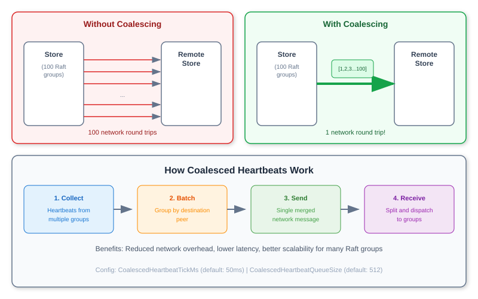
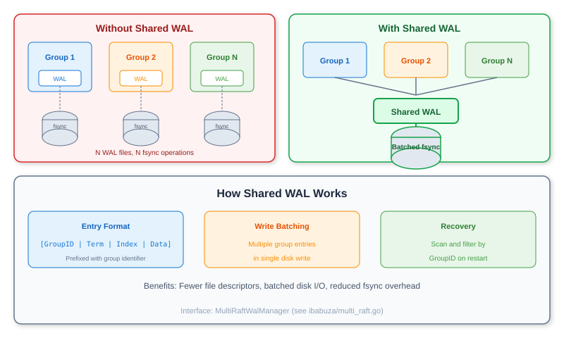
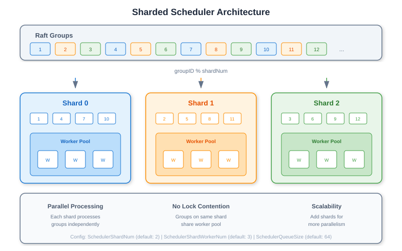

# raft/experimental

Experimental multi-Raft implementation with coalesced heartbeats and shared WAL, built on top of unmodified etcd Raft.

## Overview

The `experimental` package implements multi-Raft group support for scenarios requiring many independent Raft groups (e.g., sharded databases). It achieves this **without modifying the etcd Raft library**, making it easy to upgrade and maintain.

## Status

**EXPERIMENTAL**: This package is under active development. APIs may change.

### Known Limitations

> **Performance Notice**: The current implementation has performance constraints that limit the number of Raft groups:
>
> - **I/O Bottleneck**: The transport and WAL subsystems require further optimization for high group counts
> - **WAL Implementation**: Currently using LSMT (Log-Structured Merge Tree) as a temporary solution
> - **Batch Writing**: WAL batch write optimization is not fully implemented yet
>
> These limitations are being actively addressed. For production use with many groups, performance testing is recommended.

### Development Notes

> **Application Responsibility**: This library does **not** provide automatic group scheduling or leader balancing functionality:
>
> - **Leader Distribution**: Applications must implement their own logic to balance leaders across stores
> - **Group Migration**: Moving Raft groups between stores requires application-level coordination
> - **Load Balancing**: Detecting hotspots and rebalancing groups is the application's responsibility
>
> Use `TransferLeader()` API to manually transfer leadership when implementing these features.
>
> **Reference Implementation**: See [examples/redis-cluster](../../examples/redis-cluster/) for a complete multi-Raft application that includes leader load balancing implementation.

## Key Features

### Coalesced Heartbeats

Instead of each Raft group sending independent heartbeats, heartbeats from multiple groups destined for the same peer are merged into a single network message:



### Shared WAL

Multiple Raft groups share a single WAL instance, reducing file descriptor usage and improving write batching:



### Sharded Scheduling

Raft groups are distributed across multiple scheduler shards for parallel processing:



## Key Types

| Type | Description |
|------|-------------|
| `Store` | Multi-Raft store managing multiple Raft groups |
| `StoreConfig` | Configuration for the store |
| `PeersConfiguration` | Per-group peer configuration |
| `Replica` | Individual Raft group instance |
| `ComponentsFactory` | Factory interface for creating state machines, clusters, etc. |
| `RaftGroupPeersInfo` | Information about peers in a Raft group |

## Public API

### Store Lifecycle

| Method | Description |
|--------|-------------|
| `BootstrapOrRecoverStore(cfg, factory, transport, walManager, snapshotManager, listener)` | Create or recover a multi-Raft store |
| `Start()` | Start the store and all Raft groups |
| `Stop()` | Stop the store and cleanup resources |

### Raft Group Management

| Method | Description |
|--------|-------------|
| `CreateRaftGroup(peersConfig, join)` | Create a new Raft group with peer configuration |
| `CreateBasicRaftGroup(groupID, localPeerID, leaderID, leaderAddr)` | Create a basic Raft group without full configuration |
| `GetGroupIDs()` | Get all Raft group IDs managed by this store |
| `HasGroupID(groupID)` | Check if a Raft group exists |
| `RemoveData(groupID)` | Remove all data for a stopped Raft group |

### Data Operations

| Method | Description |
|--------|-------------|
| `Propose(ctx, groupID, session, data)` | Propose data to a Raft group (returns `ProposedResult`) |
| `LinearizableRead(ctx, groupID)` | Perform a linearizable read (ensures read-after-write consistency) |
| `Query(groupID, key)` | Query the state machine directly (non-linearizable) |

### Session Management

| Method | Description |
|--------|-------------|
| `RegisterSession(ctx, groupID)` | Register a new client session for exactly-once semantics |
| `UnregisterSession(ctx, groupID, sessionID)` | Unregister an existing client session |

### Cluster Membership

| Method | Description |
|--------|-------------|
| `AddVotingPeer(ctx, groupID, session, peerAttr)` | Add a voting member to the Raft group |
| `AddLearner(ctx, groupID, session, peerAttr)` | Add a learner (non-voting) member |
| `PromoteLearner(ctx, groupID, session, peerID)` | Promote a learner to voting member |
| `RemovePeer(ctx, groupID, session, peerID)` | Remove a peer from the Raft group |
| `TransferLeader(ctx, groupID, transferee)` | Transfer leadership to another peer |

### Status & Monitoring

| Method | Description |
|--------|-------------|
| `RaftGroupStatus(groupID)` | Get detailed status of a Raft group |
| `RaftGroupPeersInfo(groupID)` | Get peer information for a Raft group |
| `StateMachine(groupID)` | Get the state machine instance for a group |

### PeersConfiguration

| Method | Description |
|--------|-------------|
| `NewPeersConfiguration()` | Create a new peer configuration |
| `SetGroupID(groupID)` | Set the Raft group ID |
| `AddPeer(peerID, storeID, raftAddr, isLearner)` | Add a peer to the configuration |
| `GroupID()` | Get the configured group ID |
| `Validate()` | Validate the configuration |

## Usage

### Create a Multi-Raft Store

```go
import (
    "github.com/fanaujie/babuza/raft/experimental"
    "github.com/fanaujie/babuza/ibabuza"
)

config := experimental.DefaultStoreConfig(
    clusterID,           // Cluster ID
    storeID,             // This store's ID
    "/var/lib/babuza",   // Storage directory
    "127.0.0.1:7001",    // Raft listen address
)

// Optional: Tune coalesced heartbeat settings
config.CoalescedHeartbeatTickMs = 50
config.CoalescedHeartbeatQueueSize = 512

// Optional: Tune scheduler settings
config.SchedulerShardNum = 4
config.SchedulerShardWorkerNum = 3

// Create required components
var factory experimental.ComponentsFactory   // Implements CreateStateMachine, CreateCluster, etc.
var transport ibabuza.MultiRaftTransport     // Network transport layer
var walManager ibabuza.MultiRaftWalManager   // WAL manager for persistence
var snapshotManager ibabuza.MultiRaftSnapshotManager
var raftListener ibabuza.MultiRaftListener   // Event callbacks

store, err := experimental.BootstrapOrRecoverStore(
    config,
    factory,
    transport,
    walManager,
    snapshotManager,
    raftListener,
)
if err != nil {
    log.Fatal(err)
}
```

### Create Raft Groups

```go
// Create peer configuration for group 1
peers := experimental.NewPeersConfiguration()
peers.SetGroupID(1)
peers.AddPeer(1, storeID1, "127.0.0.1:7001", false)
peers.AddPeer(2, storeID2, "127.0.0.1:7002", false)
peers.AddPeer(3, storeID3, "127.0.0.1:7003", false)

// Create the Raft group
err := store.CreateRaftGroup(peers, false)

// Create more groups...
peers2 := experimental.NewPeersConfiguration()
peers2.SetGroupID(2)
// ...
err = store.CreateRaftGroup(peers2, false)
```

### Start and Use

```go
// Start the store
if err := store.Start(); err != nil {
    log.Fatal(err)
}
defer store.Stop()

// Propose to a specific group
result := store.Propose(ctx, groupID, session, data)

// Linearizable read from a group
if err := store.LinearizableRead(ctx, groupID); err != nil {
    return err
}
```

## Configuration

### StoreConfig

| Field | Default | Description |
|-------|---------|-------------|
| `ClusterID` | - | Cluster identifier |
| `StoreID` | - | This store's unique ID |
| `StoreHostDir` | - | Root storage directory |
| `RaftListenAddress` | - | Raft communication address |
| `CoalescedHeartbeatTickMs` | 50 | Heartbeat coalescing interval |
| `CoalescedHeartbeatQueueSize` | 512 | Max pending heartbeats |
| `SchedulerShardNum` | 2 | Number of scheduler shards |
| `SchedulerShardWorkerNum` | 3 | Workers per shard |
| `SchedulerQueueSize` | 64 | Queue size per shard |
| `JobQueueShardNum` | 4 | Async job queue shards |
